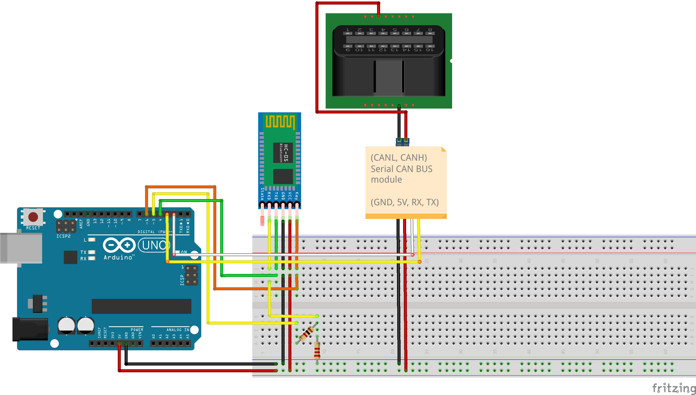
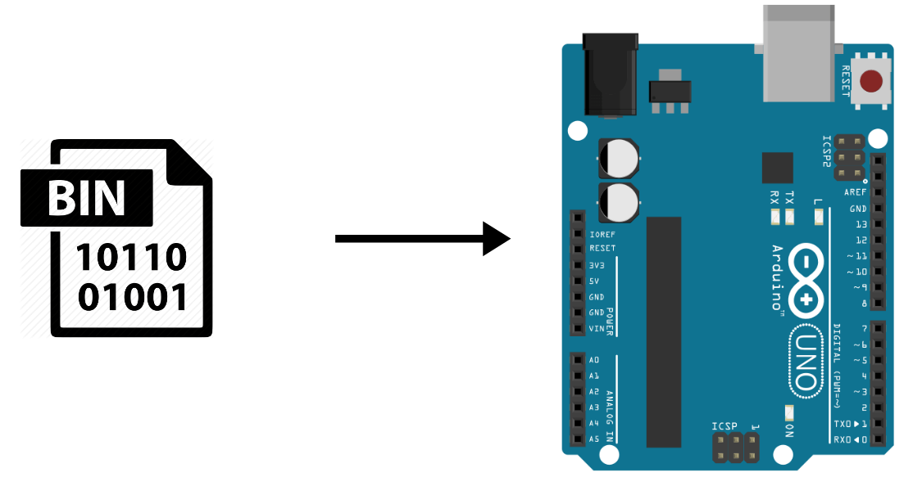
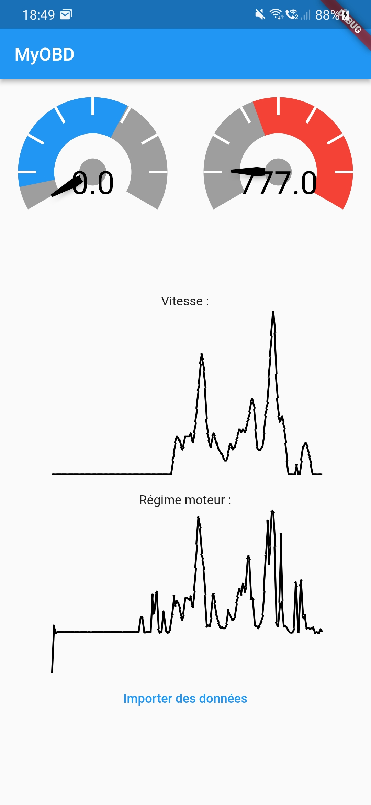

# Module OBD-II pour l'éco-conduite

Ce dépôt contient toute la documentation permettant de réaliser un prototype reliant un véhicule automobile et une application mobile permettant d’utiliser les données de la voiture en temps réel, dans le but de conseiller l’utilisateur dans sa conduite et l'inviter à adopter une conduite éco-responsable.

Vous trouverez dans ce README toutes les informations relatives à la construction du prototype, son installation, et son utilisation. Une documentation plus détaillée du projet dans son ensemble est également disponible sous forme de wiki.

## Construction du prototype
### Matériel et branchements
Nous avons réalisé ce prototype avec le matériel suivant :
- 1x [Arduino Uno](https://www.gotronic.fr/art-carte-arduino-uno-12420.htm)
- 1x [module Bluetooth HC05](https://www.gotronic.fr/art-module-bluetooth-hc05-26097.htm)
- 1x [kit CAN OBD-II](https://www.gotronic.fr/art-kit-obd-ii-can-bus-114991438-27341.htm) ([Documentation](https://docs.longan-labs.cc/1030001/))
- 1x [Breadboard](https://www.gotronic.fr/art-plaque-de-montage-rapide-6858.htm) et [câbles jumper](https://www.gotronic.fr/art-pack-de-cables-de-connexion-12411.htm)
- 1x résistance 1kΩ
- 1x résistance 2,2kΩ

Voici le schéma des branchements :

- Les deux résistances permettent de créer un pont diviseur de tension de 5V vers 3,3V afin de pouvoir fonctionner avec le module Bluetooth
- Le module Serial CAN Bus du kit CAN OBD-II possède un connecteur Grove et peut être directement connecté à l'Arduino via un shield Grove, ce qui simplifie encore plus le schéma de branchements.
- Les broches correspondant aux lignes CAN de l'OBD-II sont les broches 6 (CAN HIGH) et 14 (CAN LOW).

### Téléversement du code source

Le code source a besoin de [cette librairie Arduino](https://github.com/Longan-Labs/Serial_CAN_Arduino) pour être compilé (il s'agit de la librarie créée par le constructeur du module Serial CAN bus). Une fois téléchargée, il vous faudra l'importer dans l'IDE Arduino. Pour cela, il faut ouvrir le projet disponible dans le dossier `Arduino/main` depuis l'IDE Arduino et d'importer la librarie au format ZIP.
Connecter l'Arduino par USB, compiler et téléverser le code source.

####  Cas du premier téléversement : Mode AT du module Bluetooth
Lors du premier téléversement, il faudra configurer le module bluetooth pour que le prototype apparaisse sous le nom de "MyOBD". Pour cela, il faut décommenter la ligne `init_AT();` dans la fonction `setup(.)`. Une fois que l'Arduino a redémarré, vous pouvez vérifier qu'il existe bien un appareil bluetooth appelé "MyOBD", recommenter la ligne décommentée précédemment et téléverser de nouveau le code source.

## Installation sur un véhicule automobile : trouver la prise de diagnostique OBD-II
Maintenant que le prototype est prêt à être utilisé, vous pouvez le connecter à votre véhicule. Il vous faudra trouver votre prise diagnostique OBD-II, vous pouvez vous aider de [ce site](https://www.outilsobdfacile.fr/emplacement-prise-connecteur-obd.php) pour savoir où elle est. La prise est directement accessible pour certains modèles; pour d'autres, il faudra probablement bouger un cache en plastique.

## Utilisation du prototype, récupération des données de diagnostic
Pour allumer le prototype, brancher la carte Arduino via son port USB.
### Depuis le moniteur série Arduino
Si vous voulez visualiser les données depuis le moniteur série de l'IDE Arduino, il vous faut brancher l'Arduino par USB et ouvrir le moniteur.
Dans l'état actuel du développement, il vous faut mettre le contact du véhicule, attendre une quinzaine de secondes, et démarrer le véhicule seulement après. 

Dans l'état actuel du développement, il vous faut mettre le contact du véhicule, attendre de voir apparaître dans la console `set filt ok`, et démarrer le véhicule seulement après.

Les données sont ensuite envoyées sur le moniteur série Arduino; les PIDs permettant d'identifier les données reçues sont indentées dans l'ordre du tableau `pids[]` situé dans `can_config.h`.

Si vous voulez obtenir des valeurs via des PIDs spécifiques, nous vous invitons à modifier le programme en créant un nouveau tableau `pids[]` et en modifiant la fonction `convert_from_bytes_to_unite(.)` ainsi que le programme principal `loop(.)`.

### Beta : Depuis l'application mobile
#### Compiler l'application mobile

Pour compiler l'application Android, il est nécessaire d'avoir les framework dart et flutter installés sur votre machine. Vous aurez également besoin du SDK Android. Un guide est disponible sur [le site de flutter](https://docs.flutter.dev/get-started/install).

Dans app/poc_app_new/, vous pouvez au choix :

- Ouvrir Android Studio et utiliser les outils intégrés pour compiler et lancer l'application
- Réaliser successivement les commandes
    >flutter pub get
    >flutter build apk

#### Visualiser les données récupérées

La connexion Bluetooth entre la carte Arduino et l'application n'est pas encore implémentée, il n'est donc pas possible de consulter les données en temps réel.

L'application s'utilise donc à postériori et simule le résultat qui aurait été obtenu lors du trajet. Pour cela, elle a besoin d'un fichier .txt ou .csv contenant la trace des données envoyées sur le moniteur série de l'arduino à partir de la première donnée. La trace nous donne ainsi un fichier csv, chaque ligne contenant un pid et la valeur associée, séparés par une virgule.

Lancez l'application, et appuyez sur "Importer des données", puis choisissez le fichier de trace à afficher. La simulation se lance instantannément après. A l'issue d'une simulation, vous obtenez un visuel ressemblant à :

## Limitations connues
Ce projet n'étant par nature qu'un prototype, il y a des limitations connues à prendre en compte si vous souhaitez l'utiliser en conditions réelles. Ces limitations connues sont décrites dans le wiki.
